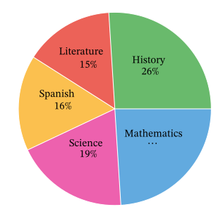

# Charts
Charts of graphical summaries of data.

## Pie Chart
- Useful for visualizing categories.
- Makes it easy to eyeball what fraction of the total a category corresponds to.

## Dot Plot
- Useful for visualizing categories.
- Makes it easy to compare frequencies of different categories.

## Bar Graph
- Useful for visualizing quantitative data.
- Is essentially a dot plot on its side.

## Histogram
- Allows blocks with different widths.
- Areas of the blocks are proportional to frequency.
- Area of each block shows relative frequency, for example in percentages.
- The height of each bar shows density (crowding); i.e. how many subjects there are for one unit on the horizontal scale.

## Box Plot
- Shows five key numbers of the data:
  - Minimum
  - Maximum
  - First Quartile
  - Second Quartile (Median)
  - Third Quartile

## Scatter Plot
- Depicts data that comes as pairs.
- Show the relationship between two variables.

# Context
Statistical analyses typically compare the observed data to a reference. Therefore context is essential for graphical integrity.

# Next
[Numerical Summaries](./2%20-%20numerical-summaries.md)