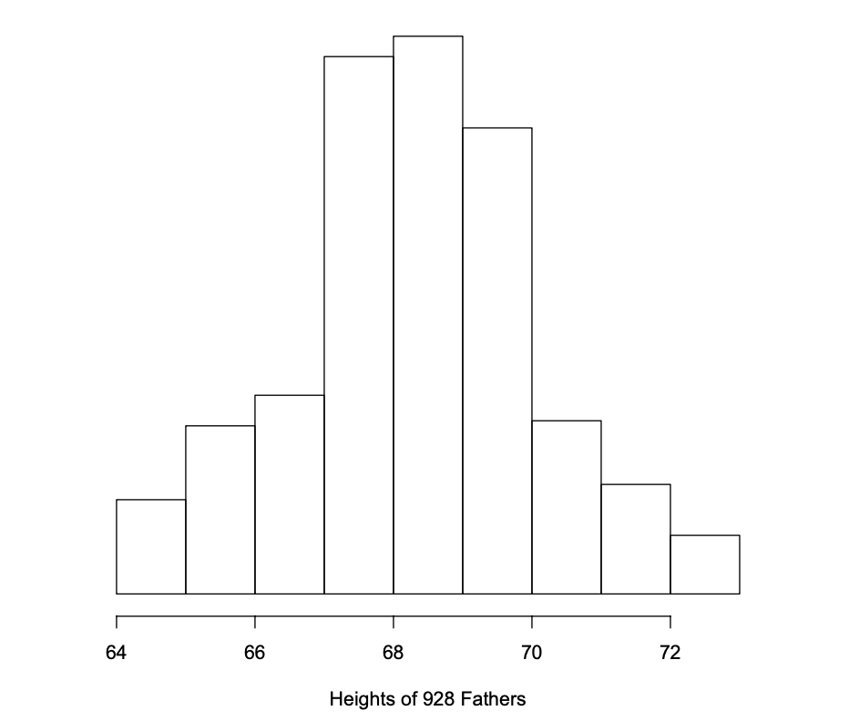
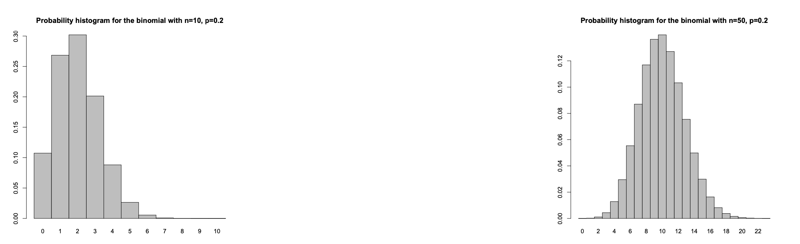

# Previous
[Probability](./4%20-%20probability.md)

# The normal curve
Many data have histograms that look bell-shaped, e.g. heights, weights, IQ scores:

## The empirical rule
If the data follow the normal curve, then:
- About $\frac{2}{3}$ (68%) of the data fall within one standard deviation of the mean.
- About 95% fall within 2 standard deviations of the mean.
- About 99.7% fall within 3 standard deviations of the mean.

## Standardizing
A normal curve is determined by $\bar{x}$ and s: If the data follow the normal curve, then knowing $\bar{x}$ and s means knowing the whole histogram.

To compute areas under the normal curve, we first standardize the data by subtracting off $\bar{x}$ and then dividing by s:
$$z = \frac{height - \bar{x}}{s}$$

`z` is called standardized value or z-score and has no units since the units cancel out in the fraction.

## The standard normal curve
Standardized data have mean 0 and standard deviation equal to 1. This is the point of standardizing. This curve is given by:
$$y = \frac{1}{\sqrt{2\pi}}e^{-\frac{1}{2}x^2}$$

## Normal Approximation
Finding areas under the normal curve is called normal approximation. We can do this by `standardizing` the data and then calculating the desired area under the normal curve by looking up in software or tables. We usually have the area to the left of a given value so we have to perform a subtraction to get the final area.

The empirical rule is a special case of normal approximation.

# Binomial Setting
- There `n` independent repetitions of an experiment.
- The experiment has two possible outcomes (`success` and `failure`).
- The probability of success is the same in each experiment.

## Binomial Formula
$$P(k \text{ successes in }n \text{ experiments}) = {n\choose k}p^k(1-p)^{n-k}$$

# Normal approximation to the binomial
As the number of experiments in a binomial setting gets larger, the probability histogram of the binomial distribution looks more and more similar to the normal curve.

We can approximate binomial probabilities using normal approximation. The mean is $np$ and the standard deviation is $\sqrt{np(1 - p)}$.

# Sampling without replacement
A simple random sample, selects subjects without replacement. This is different from the binomial setting because `p` changes after each selection. But if the population is much larger than the sample, then sampling with replacement is about the same as sampling without replacement. So the number of successes will approximately have the binomial distribution and can be calculated using normal approximation).

# Next
[Central Limit Theorem and Law of Large Numbers](./6%20-%20clt-and-lln.md)